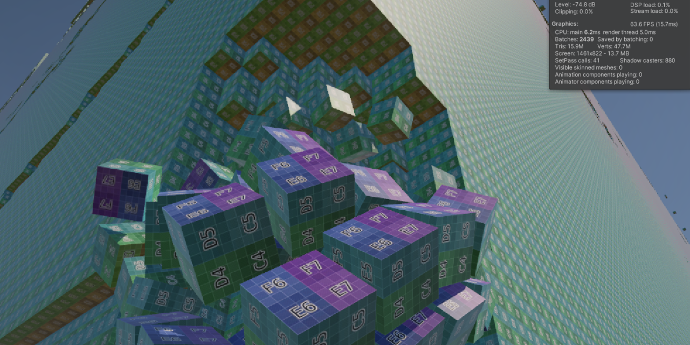

# Simple Mesh Mining Sample

Welcome to the Simple Mesh Mining Sample repository!  
This repository is a sample where the surrounding area, when clicked, undergoes mesh subdivision and is cubified to demonstrate physical behavior. The key feature here is the use of large merged meshes displayed in the distance, which undergo spatial downsampling to reduce memory usage.



## Getting Started
Follow these steps to try out the Sample:

1. Clone this repository.
1. Open the project from the cloned folder using Unity Hub.
1. Play the sample scene.
1. Click the screen.

# ランタイムメッシュ採掘サンプル

**ランタイムメッシュ採掘サンプル** リポジトリへようこそ！  
このリポジトリはクリックした周辺をメッシュ細分化し、キューブ化したものが物理挙動するサンプルです。  
遠方に表示される巨大なマージメッシュが空間低解像度化してメモリ使用量を削減している点がポイントです。    

## 始め方

以下の手順に従って、サンプルをお試しできます。

1. このリポジトリをクローンします。
1. Unity Hub 経由でクローンしたフォルダからプロジェクトを開きます。
1. サンプルシーンを開いて再生します。
1. 画面をクリックします。

## How to use

```csharp
using System.Collections;
using System.Collections.Generic;
using System.IO;
using System.Threading.Tasks;
using Unity.Collections;
using Unity.Jobs;
using Unity.Mathematics;
using UnityEngine;
using UnityEngine.Rendering;

namespace SimplestarGame
{
    public class IndexXYZ
    {
        public NativeArray<XYZ> xyz;
        public NativeArray<int> countOffsets;
    }

    public class SimpleMeshMiningSample : MonoBehaviour
    {
        [SerializeField] string meshFileName = "BasicCube.caw";
        [SerializeField] string dataFileName = "world000.gz";
        [SerializeField] Material material;
        [SerializeField] WebGLUtil webGLUtil;
        [SerializeField] Transform mainCamera;
        [SerializeField] Transform[] parents;
        List<Vector3> interactPoints = new List<Vector3>();
        [SerializeField] Color[] levelColors = new Color[] {
            Color.white * 0.2f,
            Color.white * 0.3f,
            Color.white * 0.4f,
            Color.white * 0.5f,
            Color.white * 0.6f,
            Color.white * 0.7f,
            Color.white * 0.8f,
            Color.white * 0.9f,
            Color.white * 0.95f,
            Color.white };

        /// <summary>
        /// ワールドを構成する最大粒度チャンク
        /// </summary>
        List<SimpleMeshChunk> chunks = new List<SimpleMeshChunk>();
        SimpleMeshChunkBuilder chunkBuilder;

        CAWFile.CubeData cubeData;
        NativeArray<byte> voxelData;
        List<IndexXYZ> levelDataList;

        Task createMeshesTask = null;
        bool cancelCreateMeshes = false;

        float timer = 0f;
        float interval = 1f; // 秒
        float gridSize = 128;
        Vector3Int cameraGridPosition;

        void Awake()
        {
            Application.targetFrameRate = 60;
            GraphicsSettings.useScriptableRenderPipelineBatching = true;
        }

        IEnumerator Start()
        {
            yield return this.webGLUtil.ReadFile(Path.Combine(Application.streamingAssetsPath, this.meshFileName));
            var cawData = this.webGLUtil.GetData();
            yield return this.webGLUtil.ReadFile(Path.Combine(Application.streamingAssetsPath, this.dataFileName));
            byte[] worldDataBytes = this.webGLUtil.GetData();
#if UNITY_EDITOR || !UNITY_WEBGL
            worldDataBytes = GZipCompressor.Decompress(worldDataBytes);
#endif
            this.Start2(cawData, worldDataBytes);
        }

        async void Start2(byte[] cawData, byte[] worldDataBytes)
        {
            this.cubeData = CAWFile.GetCAWFile(cawData);
            this.voxelData = await Task.Run(() => new NativeArray<byte>(worldDataBytes, Allocator.Persistent));
            // Job用NativeArray確保
            this.levelDataList = await AllocateDataAsync();
            // ビルダーを初期化
            this.chunkBuilder = new SimpleMeshChunkBuilder(this.cubeData, this.voxelData, this.levelDataList, this.material, this.levelColors);

            // チャンクオブジェクトを作成、リスト化
            this.chunks.Clear();
            foreach (var parent in this.parents)
            {
                var myChunkLevel = ChunkLevel.Cube256;
                var edgeCubes = SimpleMeshChunk.levelEdgeCubes[(int)myChunkLevel];
                for (int chunkX = 0; chunkX < 1; chunkX++)
                {
                    for (int chunkY = 0; chunkY < 1; chunkY++)
                    {
                        for (int chunkZ = 0; chunkZ < 1; chunkZ++)
                        {
                            var chunkOffset = new Vector3Int(chunkX, chunkY, chunkZ) * edgeCubes;
                            var newGameObject = new GameObject($"{chunkX}, {chunkY}, {chunkZ}");
                            newGameObject.transform.SetParent(parent.transform, false);
                            newGameObject.transform.localPosition = chunkOffset;
                            newGameObject.isStatic = true;
                            var chunk = newGameObject.AddComponent<SimpleMeshChunk>();
                            chunk.SetData(myChunkLevel, chunkOffset);
                            this.chunks.Add(chunk);
                        }
                    }
                }
            }
            this.createMeshesTask = this.CreateWorldMeshes(this.chunks, new Vector3[0]);
        }

        void OnDestroy()
        {
            // 確保したものを開放
            foreach (var levelData in this.levelDataList)
            {
                levelData.countOffsets.Dispose();
                levelData.xyz.Dispose();
            }
            this.voxelData.Dispose();
            this.cubeData.vertexData.Dispose();
            this.cubeData.vertexCounts.Dispose();
        }

        async void Update()
        {
            // タイマーを更新
            this.timer += Time.deltaTime;

            // タイマーが指定した間隔を超えた場合に処理を実行
            if (this.timer >= this.interval)
            {
                var lastGridPosition = this.cameraGridPosition;
                this.cameraGridPosition = this.CalculateGridPosition(this.mainCamera.position);
                if (lastGridPosition != this.cameraGridPosition)
                {
                    await this.ReBuildMesh();
                }
                // タイマーをリセット
                this.timer = 0f;
            }

            // Space キーを押すと、興味ポイント付近のメッシュを再構築
            if (Input.GetKeyDown(KeyCode.Space))
            {
                await this.ReBuildMesh();
            }

            // クリックまたはタップされたら交点を計算する
            if (Input.GetMouseButtonDown(0)) // 左クリックで交点を計算
            {
                // マウスポインターの位置を取得
                Vector3 mousePosition = Input.mousePosition;
                var mainCamera = this.mainCamera.GetComponent<Camera>();

                // マウスポインターの位置をカメラからの距離に変換
                mousePosition.z = mainCamera.nearClipPlane;

                // マウスポインターの位置をワールド座標に変換
                Vector3 worldPosition = mainCamera.ScreenToWorldPoint(mousePosition);

                // カメラからマウスポインターの位置に向かうレイを作成
                Ray ray = new Ray(mainCamera.transform.position, worldPosition - mainCamera.transform.position);
                if (Physics.Raycast(ray, out RaycastHit hit))
                {
                    var p = hit.point + ray.direction * 0.5f;
                    this.interactPoints.Add(new Vector3(Mathf.RoundToInt(p.x), Mathf.RoundToInt(p.y), Mathf.RoundToInt(p.z)));
                    if (this.interactPoints.Count > 10)
                    {
                        this.interactPoints.RemoveAt(0);
                    }
                    await this.ReBuildMesh();
                }
            }
        }

        Vector3Int CalculateGridPosition(Vector3 position)
        {
            // グリッドのセルサイズに合わせて位置を切り捨てて計算
            int x = Mathf.FloorToInt(position.x / this.gridSize);
            int y = Mathf.FloorToInt(position.y / this.gridSize);
            int z = Mathf.FloorToInt(position.z / this.gridSize);

            return new Vector3Int(x, y, z);
        }

        async Task ReBuildMesh()
        {
            while (this.createMeshesTask != null && !this.createMeshesTask.IsCompleted)
            {
                this.cancelCreateMeshes = true;
                await Task.Delay(100);
            }
            this.createMeshesTask = this.CreateWorldMeshes(this.chunks, this.interactPoints.ToArray());
        }

        /// <summary>
        /// チャンクを順番にメッシュオブジェクト化
        /// </summary>
        /// <param name="chunks">ソートされたチャンク一覧</param>
        /// <param name="interactPoints">興味ポイント座標一覧</param>
        /// <returns>async Task</returns>
        async Task CreateWorldMeshes(List<SimpleMeshChunk> chunks, Vector3[] interactPoints)
        {
            this.cancelCreateMeshes = false;
            // 現在のチャンク一覧をカメラに近い順にソート
            var mainCamera = Camera.main.transform;
            await this.SortChunksAsync(chunks, mainCamera.position, mainCamera.forward);
            List<GameObject> meshObjectList = new List<GameObject>();
            foreach (var chunk in chunks)
            {
                if (this.cancelCreateMeshes)
                {
                    break;
                }
                if (chunk.dot < 0f && chunk.distance > 256 && chunk.cubeSize >= CubeSize.Size2)
                {
                    // 表示不要なものはスキップ
                    continue;
                }
                await this.chunkBuilder.CreateChunkMesh(meshObjectList, chunk, interactPoints, true);

                this.RemoveUnitCubeObjects(chunk, interactPoints);
            }
            await this.chunkBuilder.BakeMeshAsync(meshObjectList, true);
        }

        void RemoveUnitCubeObjects(SimpleMeshChunk chunk, Vector3[] interactPoints)
        {
            if (chunk.children != null)
            {
                foreach (var child in chunk.children)
                {
                    this.RemoveUnitCubeObjects(child, interactPoints);
                }
            }
            if (chunk.chunkLevel == ChunkLevel.Cube1 && chunk.meshObject != null && this.chunkBuilder.IsNearInteractPoints(chunk, interactPoints, 2f))
            {
                this.voxelData[chunk.offset.x * SimpleMeshChunk.dataEdgeCubeCount * SimpleMeshChunk.dataEdgeCubeCount +
                    chunk.offset.y * SimpleMeshChunk.dataEdgeCubeCount + chunk.offset.z] = 0;
                var unitCube = chunk.meshObject;
                unitCube.GetComponent<MeshCollider>().convex = true;
                unitCube.AddComponent<Rigidbody>();
                unitCube.transform.SetParent(null, true);
                chunk.meshObject = null;
                StartCoroutine(this.CoDestroyCube(unitCube, 30f));
            }
        }

        IEnumerator CoDestroyCube(GameObject unitCube, float delay)
        {
            yield return new WaitForSeconds(delay);
            if (unitCube.TryGetComponent(out MeshFilter meshFilter))
            {
                if (null != meshFilter.sharedMesh)
                {
                    meshFilter.sharedMesh.Clear();
                }
                Destroy(meshFilter.sharedMesh);
            }
            Destroy(unitCube);
        }

        async Task SortChunksAsync(List<SimpleMeshChunk> chunks, Vector3 viewPoint, Vector3 viewDirection)
        {
            await Task.Run(() => { SortChunks(chunks, viewPoint, viewDirection); });
        }

        static void SortChunks(List<SimpleMeshChunk> chunks, Vector3 viewPoint, Vector3 viewDirection)
        {
            var points = new NativeArray<float3>(chunks.Count, Allocator.Persistent);
            var cameraDistances = new NativeArray<DotDistance>(chunks.Count, Allocator.Persistent);
            for (int i = 0; i < chunks.Count; i++)
            {
                var chunk = chunks[i];
                points[i] = chunk.center;
            }
            var calculateCameraDistanceJob = new CalculateDotDistanceJob()
            {
                points = points,
                viewPoint = viewPoint,
                viewDirection = viewDirection,
                dotDistances = cameraDistances
            };
            calculateCameraDistanceJob.Schedule(points.Length, 1).Complete();
            for (int i = 0; i < cameraDistances.Length; i++)
            {
                var cameraDistance = cameraDistances[i];
                chunks[i].distance = cameraDistance.distance;
                chunks[i].dot = cameraDistance.dot;
            }
            cameraDistances.Dispose();
            points.Dispose();
            chunks.Sort((a, b) => a.distance > b.distance ? 1 : -1);
        }

        /// <summary>
        /// 計算で毎回使うバッファ、使いまわすために最初に確保
        /// </summary>
        /// <returns>確保したバッファ</returns>
        static async Task<List<IndexXYZ>> AllocateDataAsync()
        {
            return await Task.Run(() => {
                List<IndexXYZ> levelDataList = new List<IndexXYZ>();
                for (ChunkLevel chunkLevel = ChunkLevel.Cube1; chunkLevel <= ChunkLevel.Cube256; chunkLevel++)
                {
                    var edgeCubeCount = SimpleMeshChunk.levelEdgeCubes[(int)chunkLevel];
                    var size = edgeCubeCount * edgeCubeCount * edgeCubeCount;
                    var xyz = new NativeArray<XYZ>(size, Allocator.Persistent);
                    var countOffsets = new NativeArray<int>(size, Allocator.Persistent);
                    for (int x = 0; x < edgeCubeCount; x++)
                    {
                        for (int y = 0; y < edgeCubeCount; y++)
                        {
                            for (int z = 0; z < edgeCubeCount; z++)
                            {
                                var index = x * edgeCubeCount * edgeCubeCount + y * edgeCubeCount + z;
                                xyz[index] = new XYZ { x = (byte)x, y = (byte)y, z = (byte)z };
                                countOffsets[index] = 0;
                            }
                        }
                    }
                    levelDataList.Add(new IndexXYZ { xyz = xyz, countOffsets = countOffsets });
                }
                return levelDataList;
            });
        }
    }
}
```

## License
This project is licensed under the MIT License.

## Contribution
If you find a bug, have an enhancement idea, or want to contribute in any other way, please open an issue or submit a pull request.
